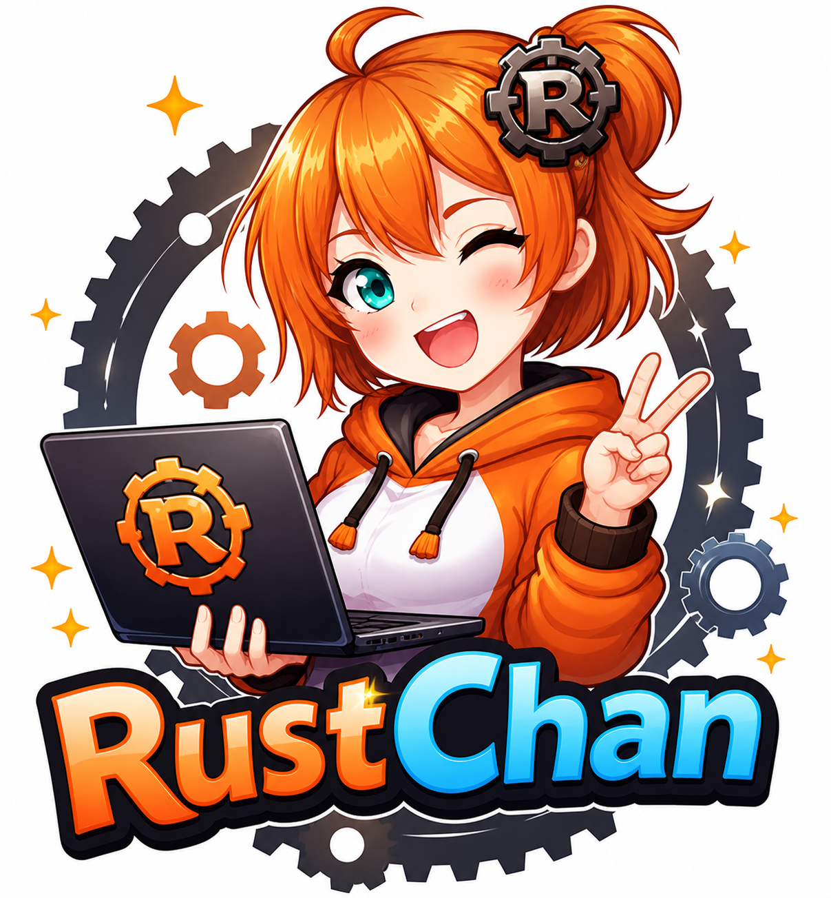
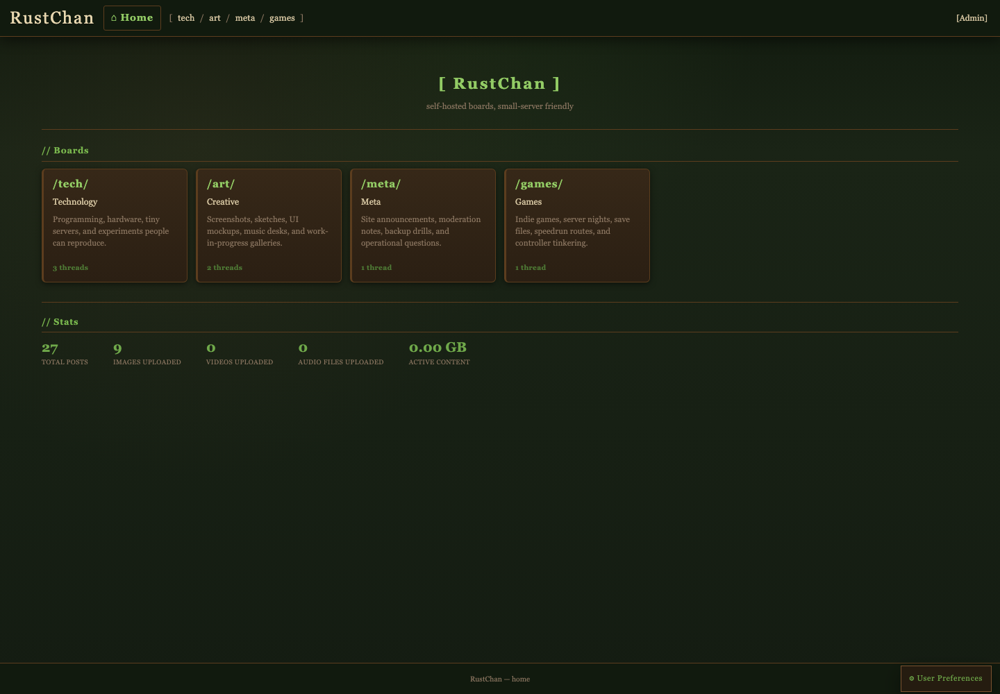
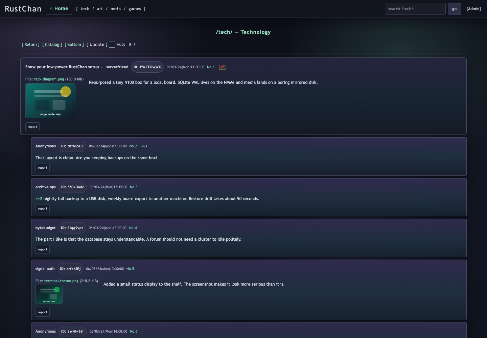
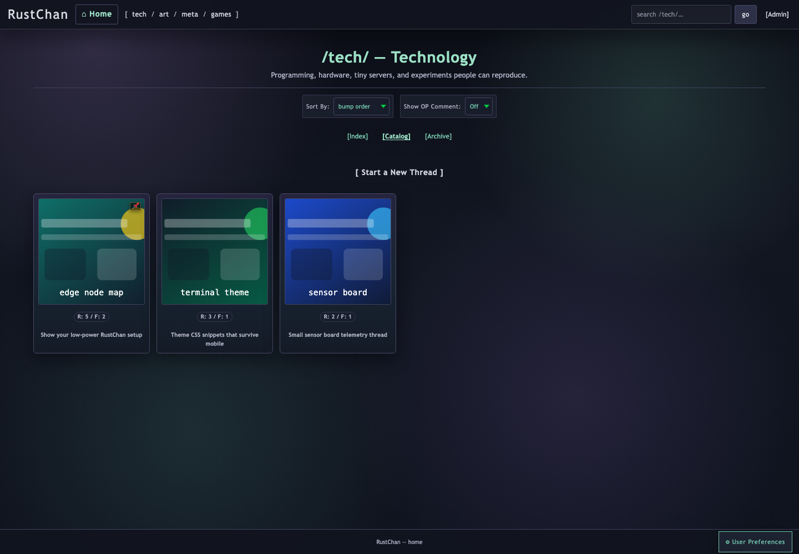
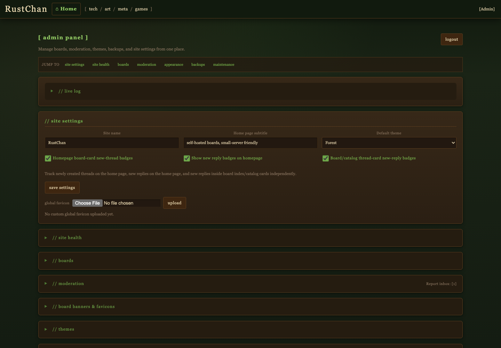
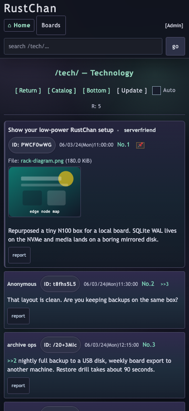

<div align="center">



# RustChan

A self-hosted imageboard written in Rust.

[](https://github.com/csd113/RustChan/actions/workflows/ci.yml)
[](https://github.com/csd113/RustChan/actions/workflows/e2e.yml)

[Screenshots](#screenshots) · [Features](#features) · [Quick start](#quick-start) · [Configuration](#configuration) · [Administration](#administration-and-recovery) · [Development](#development)

</div>

RustChan gives you boards, threads, replies, media uploads, moderation, backups, themes, and an admin panel without requiring a stack of services. It runs as one binary, uses bundled SQLite, and keeps its runtime files in one data directory.

Current version: `1.4.1`. Minimum supported Rust version: `1.91`.

## Screenshots

<p align="center">
  
</p>

<p align="center">
  
</p>

<details>
<summary>Catalog, admin panel, and mobile views</summary>

<p align="center">
  
</p>

<p align="center">
  
</p>

<p align="center">
  
</p>

</details>

## Features

- Multiple boards with their own access, posting, media, cooldown, captcha, and archive settings
- Threads, replies, catalogs, archives, board search, polls, tripcodes, sage, spoilers, poster IDs, and quote links
- JPEG, PNG, GIF, WebP, HEIC, HEIF, BMP, TIFF, SVG, MP4, WebM, MP3, OGG, FLAC, WAV, M4A, and AAC uploads
- Optional PDF and generic file uploads, controlled globally and per board
- Streaming upload validation, image thumbnails, video thumbnails, audio waveforms, and optional MP4-to-WebM transcoding
- Browser-based moderation, reports, appeals, bans, themes, banners, favicons, backups, restores, and maintenance
- Full-site and per-board backups, scheduled backups, integrity checks, repair helpers, and media reconciliation
- Built-in Arti onion service, optional native TLS, and an optional ChanNet listener
- Hashed client IPs, Argon2id admin passwords, CSRF protection, secure sessions, rate limiting, and security headers
- Responsive pages with JavaScript enhancements and supported no-JavaScript fallbacks

No Docker, Postgres, or Redis is required.

## Quick start

You need Rust `1.91` or newer. RustChan works without `ffmpeg`, but installing `ffmpeg` and `ffprobe` enables the full media pipeline.

```bash
git clone https://github.com/csd113/RustChan.git
cd RustChan
cargo build --release

./target/release/rustchan-cli admin create-admin admin "ChangeThisPasswordNow"
./target/release/rustchan-cli admin create-board b "Random" "General discussion"
./target/release/rustchan-cli admin create-board tech "Technology" "Programming and hardware"

./target/release/rustchan-cli
```

Open `http://localhost:8080`. The admin panel is at `http://localhost:8080/admin`.

On Windows, use `target/release/rustchan-cli.exe`. For a service installation, give RustChan an absolute data directory such as `--data-dir /var/lib/rustchan`.

The full installation and deployment walkthrough is in [SETUP.md](SETUP.md). It covers Rust and `ffmpeg` installation, systemd, reverse proxies, TLS, Tor, updates, and troubleshooting.

## Configuration

On first run, RustChan creates `rustchan-data/` next to the executable. Pass `--data-dir /absolute/path` to put the complete runtime somewhere else. The server reads `settings.toml` from that selected directory, not from the current working directory.

```text
rustchan-data/
├── settings.toml
├── chan.db
├── logs/
├── backups/
│   ├── full/
│   └── boards/
├── runtime/
│   ├── tls/
│   ├── tor/
│   ├── favicon/
│   └── tmp/
└── boards/
```

Back up the whole directory if you want to move or recover a site.

Fresh configuration files document the available settings inline. A basic configuration looks like this:

```toml
forum_name = "RustChan"
site_subtitle = "select board to proceed"
default_theme = "forest"
port = 8080
enable_tor_support = true
require_ffmpeg = false

[tls]
enabled = false
require_https = false
port = 8443
```

Common runtime options:

| Option | What it does |
|---|---|
| `--data-dir /absolute/path` | Selects the complete runtime directory |
| `--port 9090` | Overrides the main listener port |
| `enable_tor_support` | Starts the built-in Arti onion service |
| `tor_only` | Binds the application to loopback and serves it through Tor |
| `require_ffmpeg` | Fails startup if the enhanced media tools are unavailable |
| `enable_any_file_uploads_feature` | Lets individual boards opt into generic file uploads |
| `[tls].enabled` | Enables the native TLS listener |
| `auto_full_backup_interval_hours` | Sets the automatic full-backup interval |

`CHAN_*` environment variables override matching configuration values. Keep `cookie_secret` stable after launch. Treat the configuration, database, backups, TLS keys, and Tor identity as private data.

### Tor and ChanNet

RustChan can run an onion service through Arti, so it does not need a separate `tor` daemon. Its persistent onion identity is stored under `rustchan-data/runtime/tor/state/`; include that directory in backups if you want to keep the same onion address.

For a Tor-only site:

```toml
enable_tor_support = true
tor_only = true
```

ChanNet is a separate, optional listener for snapshot transfer, content polling, remote refresh, and RustWave integration. It is disabled by default and listens on `127.0.0.1:7070` unless reconfigured. If you are not using it, leave it off. If you are, keep it behind a trusted network boundary.

### Media tools

Without `ffmpeg`, RustChan still validates and stores supported media and can create basic image thumbnails. With compatible `ffmpeg` and `ffprobe` builds, it can also create video thumbnails and audio waveforms, use the enhanced WebP path, and transcode MP4 uploads to WebM when the required VP9 and Opus encoders are present.

Set `require_ffmpeg = true` if those capabilities are mandatory for your deployment.

## Administration and recovery

Most day-to-day work happens in the browser admin panel. It covers boards, access rules, media limits, reports, appeals, bans, themes, banners, favicons, storage, background jobs, backups, restores, and maintenance.

Bootstrap and shell-friendly commands include:

```text
rustchan-cli admin create-admin
rustchan-cli admin reset-password
rustchan-cli admin list-admins
rustchan-cli admin create-board
rustchan-cli admin delete-board
rustchan-cli admin list-boards
rustchan-cli admin ban
rustchan-cli admin unban
rustchan-cli admin list-bans
rustchan-cli admin db-status
```

Run `rustchan-cli admin --help` for arguments and flags.

Full-site and per-board backups can be saved on disk or downloaded. Restores accept uploaded archives and saved backups. RustChan checks archive paths, sizes, structure, and expansion before it changes live data, but you should still keep independent copies and test your restore process.

### Health and metrics

`/healthz` is a minimal public liveness check. `/readyz` only reports readiness by default, and `/metrics` returns `404` unless you enable it.

```toml
public_readiness_details = true
public_metrics_enabled = true
```

Detailed readiness and metrics can reveal database health, backup age, media queues, maintenance state, and Tor status. Restrict them at a trusted reverse proxy or network boundary.

## Security notes

RustChan hashes client IP addresses instead of storing or logging them directly. Admin passwords use Argon2id; sessions are `HttpOnly` and `SameSite=Strict`; state-changing forms use CSRF tokens; uploads and restores are checked before filesystem or database changes.

Those controls do not make an operator, server, proxy, or deployment trustworthy. Operators are still responsible for secrets, moderation, backups, network configuration, and local law. See [SECURITY.md](SECURITY.md) for the project's security policy and reporting scope.

## Development

RustChan uses Axum, Tokio, bundled SQLite through `rusqlite`, server-rendered Rust templates, `rustls`, Arti, and an in-process worker queue.

Run the Rust checks before submitting changes:

```bash
cargo fmt --all --check
cargo clippy --locked --workspace --all-targets --all-features
cargo test --locked --workspace --all-features
```

Browser tests use Playwright:

```bash
npm ci
npx playwright install
npm run test:e2e:ci
```

Some media tests need `ffmpeg`, `ffprobe`, and specific codecs. See [CONTRIBUTING.md](CONTRIBUTING.md) for the full development workflow.

## Documentation

- [SETUP.md](SETUP.md) — installation, deployment, Tor, TLS, and troubleshooting
- [CONTRIBUTING.md](CONTRIBUTING.md) — development and contribution workflow
- [SECURITY.md](SECURITY.md) — security policy and reporting scope
- [SUPPORT.md](SUPPORT.md) — support boundaries and operator responsibilities
- [CHANGELOG.md](CHANGELOG.md) — release history
- [LICENSE](LICENSE) — MIT license
