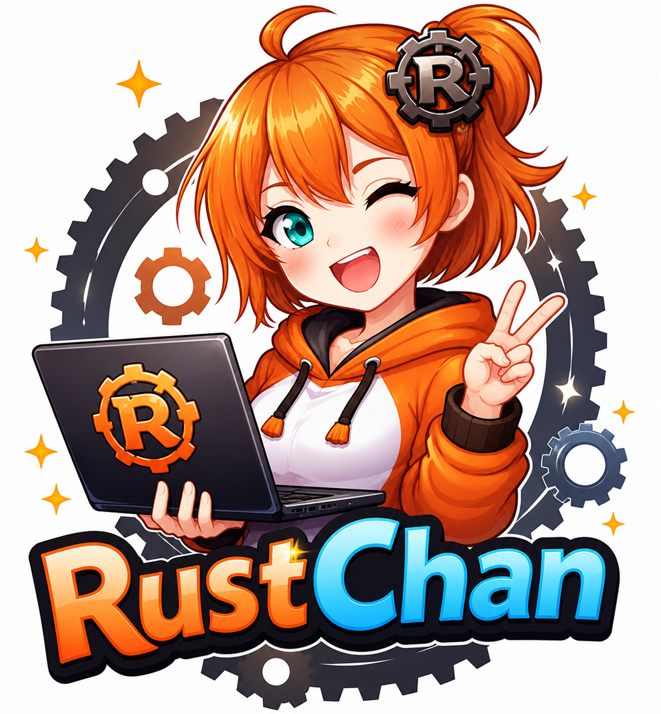
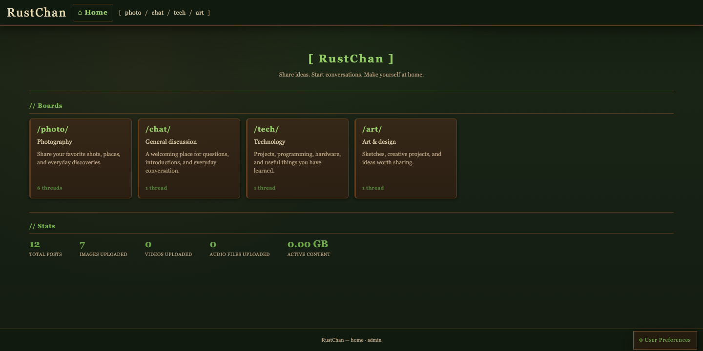
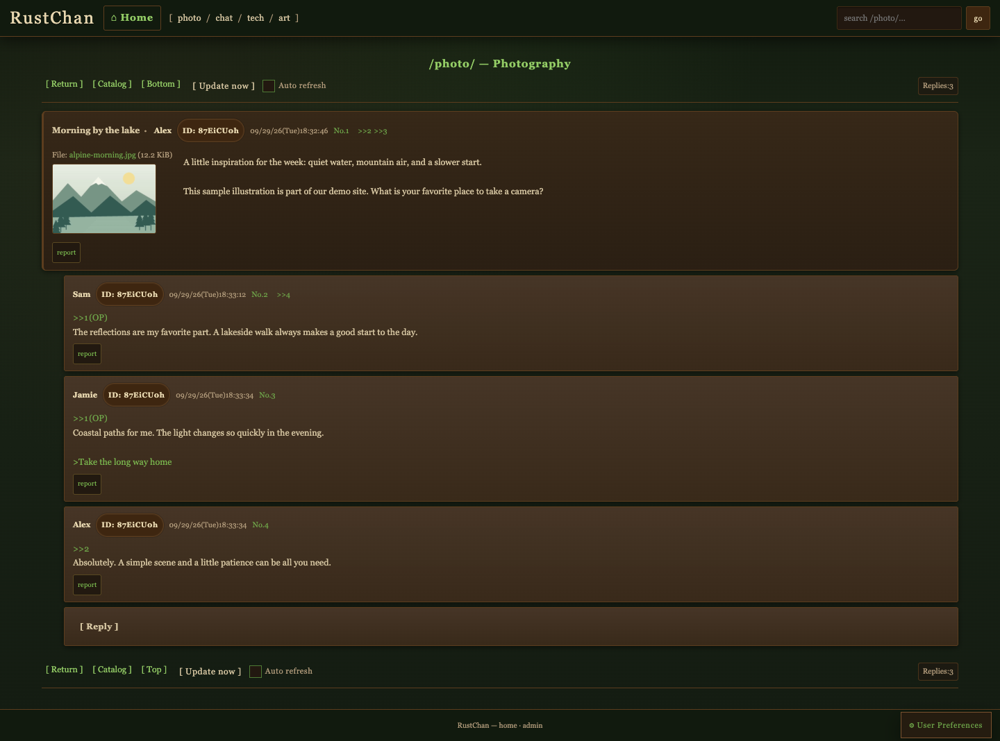
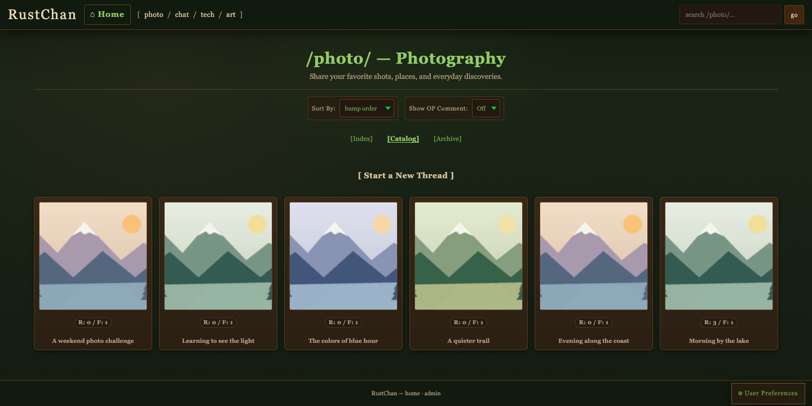
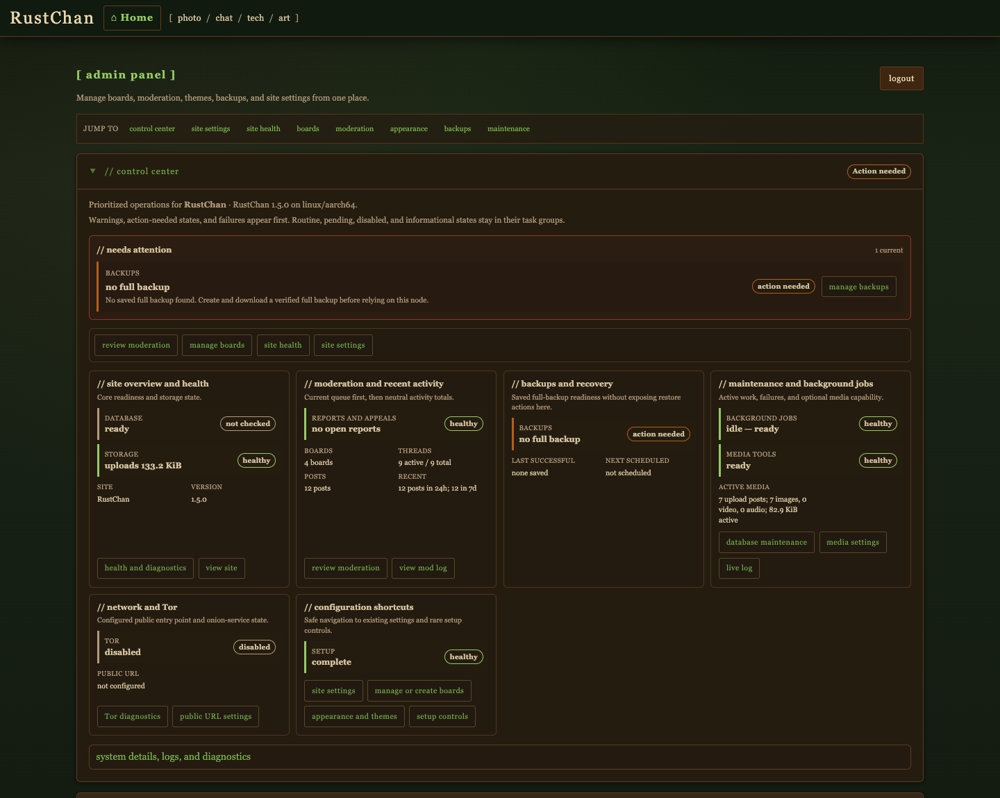
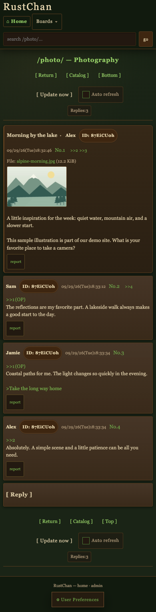

<div align="center">



# RustChan

**Your own place for image-based conversations.**

[](https://github.com/csd113/RustChan/actions/workflows/ci.yml)

[Get started](#quick-start) · [Screenshots](#screenshots) · [Features](#features) · [Settings](#configuration) · [Help and guides](#documentation)

</div>

RustChan is a free, self-hosted imageboard: a discussion website where people start conversations, share pictures and other media, and reply to one another. **Self-hosted** means you run the site on your own computer or server and manage its content and settings.

Conversations are organized into **boards** (topics such as photography or technology). Each board contains **threads** (individual conversations) and **replies**. You manage the site through an admin panel in your browser.

RustChan runs as a single app, with a built-in database. You do not need to set up a separate database server.

**Source version:** v1.6.0. **Downloads:** [latest published release](https://github.com/csd113/RustChan/releases/latest). **Docker image:** `ghcr.io/csd113/rustchan:latest`.

## Quick start

Choose the option that suits you:

| Option | Best for | What you need |
|---|---|---|
| [Docker](#start-with-docker) | Running the ready-made app with its media tools included | Docker running on your computer or server |
| [Download the app](#download-the-app) | Running RustChan directly, without Docker or compiling code | A supported Linux, macOS, or Windows computer |
| [Build from source](#build-from-source) | Developers who want to build the app themselves | Git and Rust 1.99 or newer |

### Start with Docker

The published container packages RustChan and its media tools together. It supports Linux AMD64 and ARM64, including use through Docker Desktop on compatible Macs and Windows computers.

Run these commands in a terminal:

```bash
docker pull ghcr.io/csd113/rustchan:latest
docker volume create rustchan-data
docker run -d --name rustchan --restart unless-stopped \
  -p 127.0.0.1:8080:8080 \
  -v rustchan-data:/data \
  ghcr.io/csd113/rustchan:latest
```

Then finish the initial setup in your browser:

1. Open [the setup page](http://localhost:8080/setup).
2. Choose a site name, create an admin account with a unique password, and name your first board. For a local trial, choose **Local/testing → load defaults** before entering your details.
3. Select **review setup**, check the details, then select **finish setup**.
4. Visit [your home page](http://localhost:8080) to start a conversation. Sign in at [the admin panel](http://localhost:8080/admin) to manage your site.

The command above makes the site available on your own computer. The `rustchan-data` volume is the storage area for your posts, uploads, settings, and backups; it keeps them when you replace the container.

Useful everyday commands:

```bash
docker logs -f rustchan   # View the app's logs; Ctrl+C stops viewing them
docker stop rustchan     # Stop the site
docker start rustchan    # Start it again
```

Images, animated GIF/WebP conversion, HEIC/HEIF, container inspection, common audio waveforms, and supported PDF previews run in Rust. The image includes `ffmpeg` for video thumbnails, WebM transcoding, and audio codecs the Rust decoders do not cover. Tor is off by default in Docker.

For **Docker Compose, updates, backups, or a public website**, follow the [container guide](docs/containers.md). Public sites need HTTPS and suitable network settings; complete setup before allowing visitors. The guide also explains how to pin an image to a specific revision instead of following `latest`.

### Download the app

Open the [latest release](https://github.com/csd113/RustChan/releases/latest), download the ZIP for your operating system, and extract it into a folder where the app can save files.

ZIP names include the release version; the v1.6.0 names are shown below. Choose the matching files from the published release you download.

| Your computer | Download |
|---|---|
| Linux, Intel or AMD 64-bit | `rustchan-cli-v1.6.0-linux-x86_64.zip` |
| Linux, ARM64 | `rustchan-cli-v1.6.0-linux-arm64.zip` |
| macOS, Apple silicon | `rustchan-cli-v1.6.0-macos-apple-silicon.zip` |
| Windows, Intel or AMD 64-bit | `rustchan-cli-v1.6.0-windows-x86_64.zip` |

From a terminal in the extracted folder, run:

```bash
# Linux or macOS
chmod +x rustchan-cli
./rustchan-cli
```

On Windows, run `rustchan-cli.exe` (or `./rustchan-cli.exe` in PowerShell). Follow the terminal's first-run prompts to create your administrator and, optionally, your first board. You can also create boards in [the admin panel](http://localhost:8080/admin). Keep the app running while you use the site.

RustChan creates a `rustchan-data` folder next to the app. Keep that folder when updating. Installing `ffmpeg` enables video processing and the audio compatibility fallback; see [SETUP.md](SETUP.md) for installation and deployment details.

### Build from source

With Git and Rust **1.99 or newer** installed:

```bash
git clone https://github.com/csd113/RustChan.git
cd RustChan
cargo build --locked --release
./target/release/rustchan-cli
```

Follow the same first-run steps as the downloaded app. On Windows, run `./target/release/rustchan-cli.exe`. See [SETUP.md](SETUP.md) for the full walkthrough.

## Screenshots

Captured from the published v1.5.0 Docker image, these views show a demonstration site with sample conversations and original sample artwork, using the default Forest theme.

**Home page — choose a board and see what is happening.**

<p align="center">
  
</p>

**A conversation — read replies, share media, and quote other posts.**

<p align="center">
  
</p>

<details>
<summary>See the catalog, admin panel, and phone view</summary>

**Catalog — browse a board's conversations as cards.**

<p align="center">
  
</p>

**Admin panel — manage boards, settings, moderation, and backups.**

<p align="center">
  
</p>

**Phone view — the same conversation on a smaller screen.**

<p align="center">
  
</p>

</details>

## Features

| For visitors | For site owners |
|---|---|
| Topic boards, conversations, replies, search, and a visual catalog | Create boards and choose who can view or post |
| Pictures, video, and audio; optional PDF and other file uploads | Set upload limits and enable media types per board |
| Quotes, polls, spoilers, and conversation archives | Review reports, manage bans and appeals, and moderate posts |
| Themes and layouts that work on phones and computers | Customize the site name, themes, banners, and favicon |
| Core browsing and posting without JavaScript | Create and restore site or board backups; schedule automatic backups |
| Optional access through a Tor onion address | Built-in Tor hosting, optional HTTPS, and site-health tools |

Supported media includes JPEG, PNG, GIF, WebP, HEIC/HEIF, BMP, TIFF, SVG, MP4, WebM, MP3, OGG, FLAC, WAV, M4A, and AAC. Available uploads depend on the site's and board's settings.

## Configuration

Most everyday settings are available in the admin panel. For server settings, edit **`settings.toml`** in the app's data directory and restart RustChan. The generated file includes explanations of its settings.

| Installation | Where your data lives |
|---|---|
| Downloaded app or source build | `rustchan-data/` next to the executable |
| Docker | `/data` inside the container, stored in the mounted volume |
| Custom location | The absolute path passed with `--data-dir /absolute/path` |

This directory contains your settings, database (`chan.db`), board uploads, logs, backups, and runtime files such as Tor identity and TLS certificates. **Keep the entire directory when moving or updating the site.** The app reads settings from this directory, regardless of where you run the command.

Common settings:

| Setting | What it controls |
|---|---|
| `forum_name` / `site_subtitle` | The site's name and short description |
| `port` | The HTTP port; normally `8080` |
| `enable_tor_support` | Whether the built-in Tor onion service runs |
| `tor_only` | Whether the site is served through Tor with a local-only listener |
| `require_ffmpeg` | Whether startup requires FFmpeg for video and uncovered audio codecs |
| `auto_full_backup_interval_hours` | How often automatic full-site backups run |
| `backup_directory` | An optional absolute path for saved backups |
| `[tls].enabled` | Whether the app's built-in HTTPS listener runs |

Matching `CHAN_*` environment variables take priority over file settings. For example, Docker's `CHAN_TOR_SUPPORT=false` keeps Tor off even if the file enables it. Docker networking and Tor-only mode need special care; use the [container guide](docs/containers.md) before changing them.

See [SETUP.md](SETUP.md) for all settings, HTTPS, Tor, reverse proxies, and running RustChan as a service.

## Administration and recovery

Sign in at `/admin` on your site to manage boards, posts, reports, bans, appearance, backups, and maintenance.

**Backups:** the admin panel can save or download full-site and per-board backups and restore them later. Keep independent copies and test that you can restore them. To copy the whole data directory yourself, stop the app first so the database and uploaded files remain consistent.

**Backup storage:** change **Admin → Backups → backup storage directory**, or set `backup_directory` in `settings.toml`, then restart. Existing backups stay in their original location, and only the active location appears in the admin panel. Use a dedicated, writable directory; mount external storage before starting the app. For Docker, a directory outside `/data` needs its own persistent mount. See the [container backup instructions](docs/containers.md#backups).

**Command-line administration:** use `rustchan-cli admin --help` to see account, board, ban, and database commands. In Docker, run it as:

```bash
docker exec rustchan rustchan-cli --data-dir /data admin --help
```

**Health checks:** `/healthz` shows that the app is running; `/readyz` checks that its database is ready. Detailed readiness and `/metrics` are optional and should be restricted to trusted access. Docker's built-in health check uses `/readyz`.

## Security notes

RustChan stores hashed client IP addresses, hashes admin passwords with Argon2id, protects forms and sessions, and validates uploads and backup archives. These protections do not guarantee anonymity or make a site operator trustworthy.

As a site owner, keep settings, secrets, databases, backups, TLS keys, and Tor identity private. Keep the generated `cookie_secret` stable between restarts. You are responsible for your server, moderation, backups, and network configuration. See [SECURITY.md](SECURITY.md) for the security policy and how to report a vulnerability.

## Development

RustChan is written in Rust using Axum, Tokio, bundled SQLite, server-rendered templates, Rustls, and Arti. Docker is optional for development.

Use Rust 1.99.0 and run the Rust checks before submitting changes:

```bash
cargo fmt --all --check
cargo check --locked --workspace --all-targets --all-features
cargo clippy --locked --workspace --all-targets --all-features -- -D warnings
cargo test --locked --workspace --all-features
RUSTDOCFLAGS="-D warnings" cargo doc --locked --workspace --all-features --no-deps
```

The workspace lint tables in `Cargo.toml` enforce the Rust and Clippy policy for
every RustChan target. They deny the main Clippy groups (`all`, `pedantic`,
`nursery`, and `cargo`) and explicit checks for panic paths, unchecked arithmetic
and indexing, conversions, ignored results, documentation, and resource safety.
Unsafe Rust is forbidden. New workspace packages must inherit this policy with
`[lints] workspace = true`. The patched upstream AAC dependency under `vendor/`
is excluded from the workspace and retains its upstream lint configuration.

Browser tests run locally; their harness and npm files are tracked, but GitHub Actions does not run browser checks. Keep browser reports and temporary screenshots out of commits; the demonstration screenshots in `docs/screenshots/` are published documentation. See [CONTRIBUTING.md](CONTRIBUTING.md) for contribution guidance.

## Documentation

| Guide | What you will find |
|---|---|
| [Container guide](docs/containers.md) | Docker, Compose, image tags, updates, and backups |
| [Setup guide](SETUP.md) | Installation, server deployment, HTTPS, Tor, and troubleshooting |
| [Contributing](CONTRIBUTING.md) | Development and contribution workflow |
| [Security policy](SECURITY.md) | Reporting vulnerabilities and security scope |
| [Support](SUPPORT.md) | Where to get help and what the project supports |
| [Changelog](CHANGELOG.md) | Release history |
| [License](LICENSE) | MIT license |

Administrator-controlled native Linux updates, signed release verification, verified pre-upgrade snapshots and automatic rollback are described in [Software Updates](docs/software-updates.md). Containers and other deployments remain check-only. `/readyz` reports the running package version and never exposes update availability.
